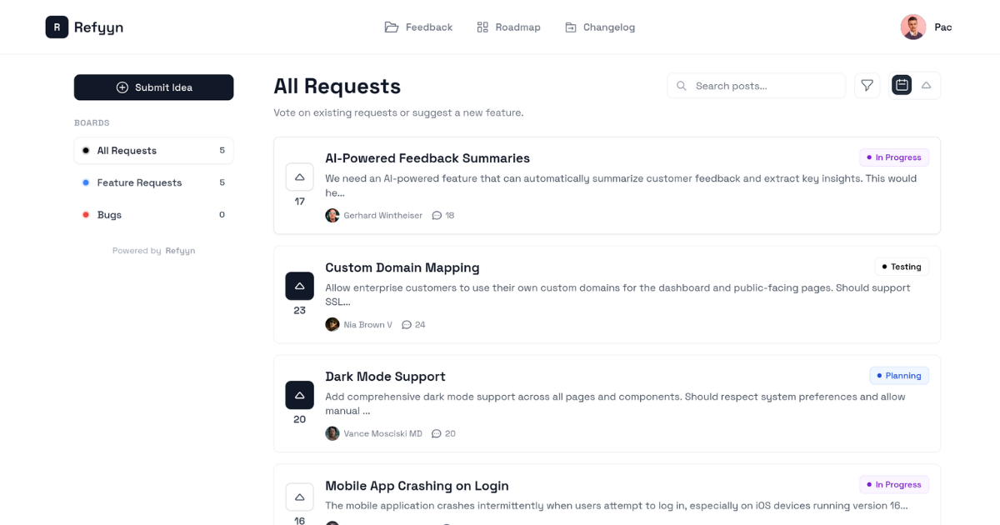

<div align="center">
  
  <h1>Refyyn</h1>
  <p>Free, open-source, self-hosted customer feedback tool</p>

  [](LICENSE)
  [](https://www.php.net/)
  [](https://laravel.com)
  [](https://vuejs.org/)
</div>

---

## What is Refyyn?

Refyyn is a simple feedback management tool you can host yourself. Users can submit feedback, vote on requests, and see what you're working on through a public roadmap and changelog.

---

## Features

### 1. Admin Dashboard


Manage all feedback from one place. View submissions, change statuses, organize into boards, and track what matters.

### 2. Public Feedback Board



Users can submit feedback, upvote existing requests, and comment on items. Everything is organized into customizable boards.

### 3. Public Roadmap


Share your product roadmap publicly. Users can see what's planned, in progress, and completed.

### 4. Changelog


Publish updates and release notes to keep users informed about what's new.

---

## Installation

### Requirements

- PHP 8.2+
- Composer
- Node.js 22+ & NPM
- SQLite, MySQL, or PostgreSQL

### Setup

1. Clone and install:
```bash
git clone https://github.com/AbdullahAftabSWE/Refyyn.git
cd refyyn
composer install
npm install
```

2. Configure:
```bash
cp .env.example .env
php artisan key:generate
```

3. Edit `.env` for your database:
```env
APP_NAME="Your Feedback Board"
DB_CONNECTION=sqlite  # or mysql/pgsql
```

4. Set up database:
```bash
php artisan migrate
php artisan db:seed  # optional sample data
```

5. Run:
```bash
composer run dev
```

6. Open http://localhost:8000

The first user you register becomes admin automatically.

---

## Production Deployment

1. Build assets:
```bash
npm run build
```

2. Optimize:
```bash
php artisan config:cache
php artisan route:cache
php artisan view:cache
```

3. Point your web server (Nginx/Apache) to the `public/` directory

4. Example Nginx config:
```nginx
server {
    listen 80;
    server_name yourdomain.com;
    root /path/to/refyyn/public;
    index index.php;

    location / {
        try_files $uri $uri/ /index.php?$query_string;
    }

    location ~ \.php$ {
        fastcgi_pass unix:/var/run/php/php8.2-fpm.sock;
        fastcgi_param SCRIPT_FILENAME $realpath_root$fastcgi_script_name;
        include fastcgi_params;
    }
}
```

---

## Usage

### Making Someone Admin

```bash
php artisan tinker
>>> $user = User::where('email', 'user@example.com')->first();
>>> $user->is_admin = true;
>>> $user->save();
```

### Customizing Boards & Statuses

Log in as admin, go to Settings, and create your own boards and statuses with custom colors.

---

## Tech Stack

- Laravel 12
- Vue 3
- Inertia.js
- Tailwind CSS
- SQLite/MySQL/PostgreSQL

---

## License

MIT License - see [LICENSE](LICENSE) file.

---

## Support

Found a bug? [Open an issue](https://github.com/AbdullahAftabSWE/Refyyn/issues)
